# Android Mediation - AdMob

To integrate the Appstock SDK into your app, you should add the following dependency into the `app/build.gradle` file and sync Gradle:

```groovy
dependencies {
  implementation("com.appstock:appstock-sdk:1.1.0")
  implementation("com.appstock:appstock-sdk-google-mobile-ads-adapters:1.1.0")
}
```

Add this custom maven repository URL into the `project/settings.gradle` file:

```groovy
dependencyResolutionManagement {
    repositories {
        maven {
            setUrl("https://public-sdk.al-ad.com/android/")
        }
    }
}
```

Initialize Appstock SDK in the  `.onCreate()` method by calling `Appstock.initializeSdk()`.

Kotlin:
```kotlin
class DemoApplication : Application() {
    override fun onCreate() {
        super.onCreate()

        // Initialize Appstock SDK
        Appstock.initializeSdk(this, PARTNER_KEY)
    }
}
```

Java:
```java
public class DemoApplication extends Application {
    @Override
    public void onCreate() {
        super.onCreate();

        // Initialize Appstock SDK
        Appstock.initializeSdk(this, PARTNER_KEY);
    }
}
```

In order to add Appstock to the waterfall, you need to create a custom event in your AdMob account and then add this event to the respective mediation groups.

To create a Appstock custom event, follow the instructions:

1. Sign in to your [AdMob account](https://apps.admob.com).
2. Click **Mediation** in the sidebar.


3. Click the **Waterfall sources** tab.

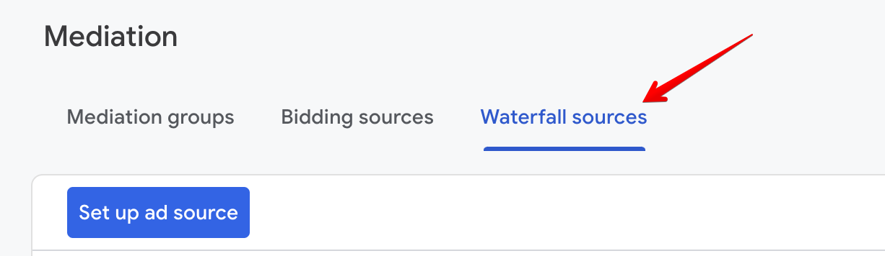

4. Click **Custom Event**.

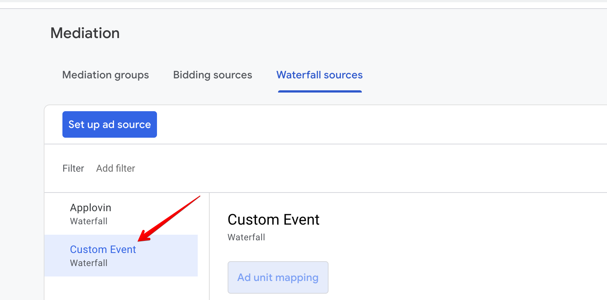

5. Find your app in the list and сlick **Manage mappings**.

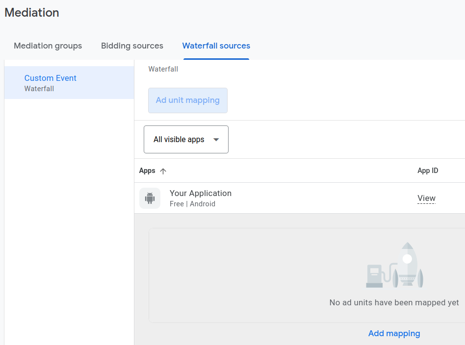

6. Click **Add mapping**. To include multiple custom events, you’ll need to set up [additional mappings](https://support.google.com/admob/answer/13395411#manage).

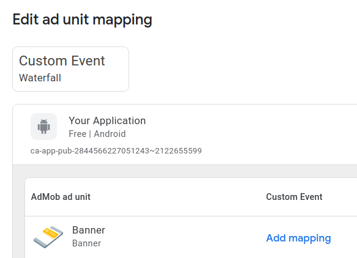

7. Add the mapping details, including a mapping name. Enter a class name (required) and a parameter (optional) for each ad unit. Typically, the optional parameter contains a JSON that contains IDs (placement ID, endpoint ID) that will be used by the custom event to load ads.

Parameters:

- **placement_id** - unique identifier generated on the platform's UI. You have to set or `placement_id` or `endpoint_id`.  
- **endpoint_id** - unique identifier generated on the platform's UI. You have to set or `placement_id` or `endpoint_id`.
- **sizes** (optional) - array of the ad sizes. You can specify width in `w` field and height in `h` field. Make sure you've provided both width and height values;
- **ad_formats** (optional) - array of the ad formats. You can pass `banner` or `video` ad formats. Note that the multiformat request is not supported for the banner ad, so it uses only first value.

Examples:
```json
{
  "placement_id": "4",
  "sizes": [
    {
      "w": 729,
      "h": 90
    }
  ],
  "ad_formats": ["video"]
}
```

```json
{
  "endpoint_id": "1",
  "sizes": [
    {
      "w": 320,
      "h": 50
    },
    {
      "w": 300,
      "h": 250
    }
  ],
  "ad_formats": ["banner"]
}
```

Class Name: **com.appstock.sdk.admob.AppstockGadMediationAdapter**

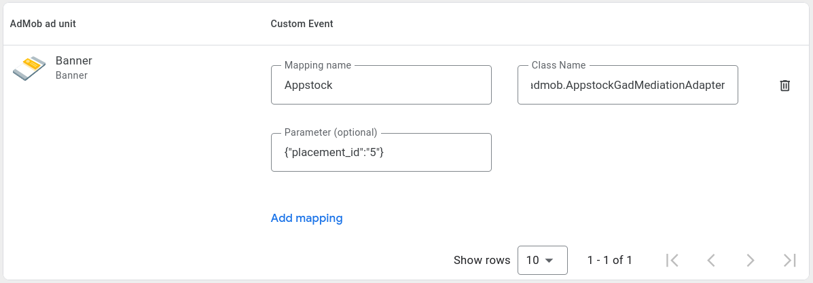

8. Click **Save**.

After you’ve finished setting up your custom event, you’re ready to add it to a mediation group. To add your ad source to an existing mediation group:

1. Sign in to your [AdMob account](https://apps.admob.com).
2. Click **Mediation** in the sidebar.


3. In the **Mediation group** tab, click the name of the mediation group to which you're adding the ad source.

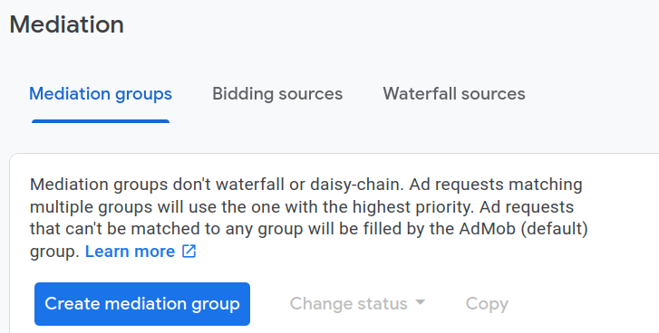

4. In the Waterfall ad sources table, click **Add custom event**.

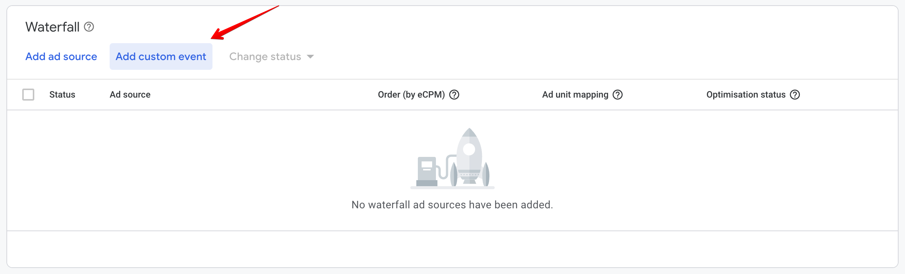

5. Enter a descriptive label for the event. Enter a manual eCPM to use for this custom event. The eCPM will be used to dynamically position the event in the mediation waterfall where it will compete with other ad sources to fill ad requests.

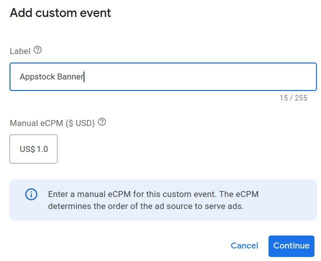

6. Click **Continue**.

7. Select an existing mapping to use for this custom event or click **Add mapping** to set up a new mapping. To use multiple custom events, you’ll have to create an additional mapping for each custom event.

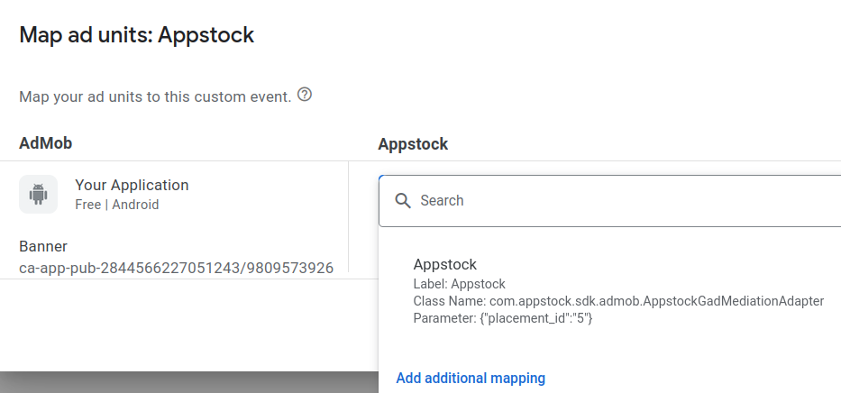

8. Click **Done**.

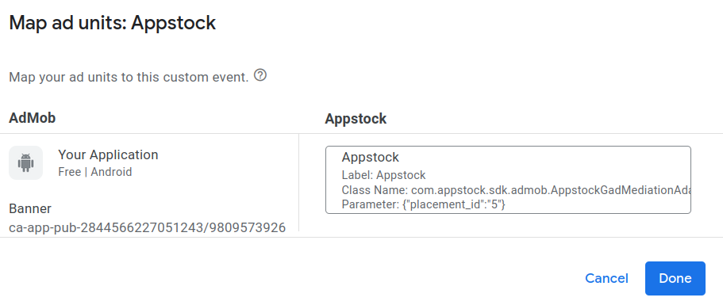

9. Click **Save**. The mediation group will be saved.

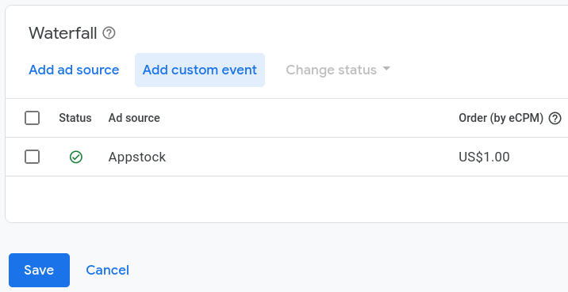
