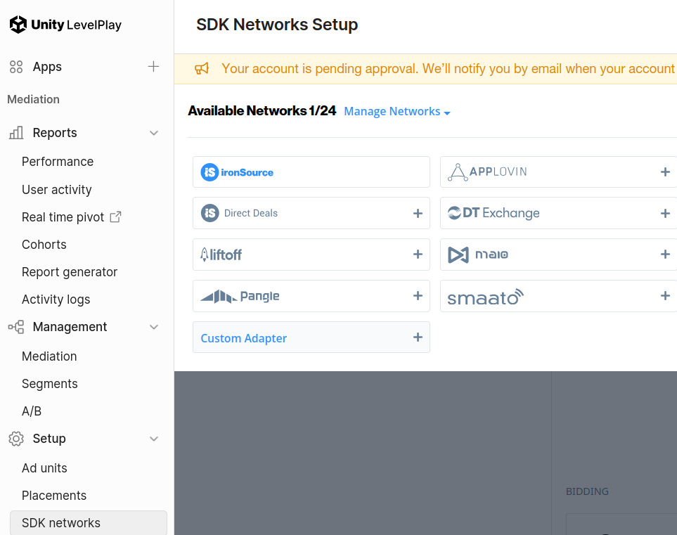
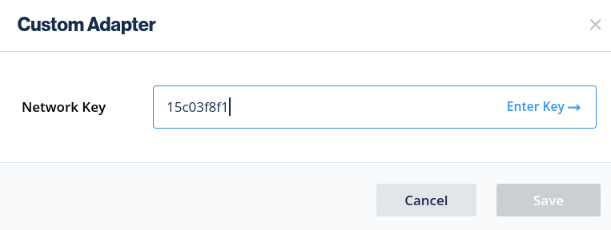
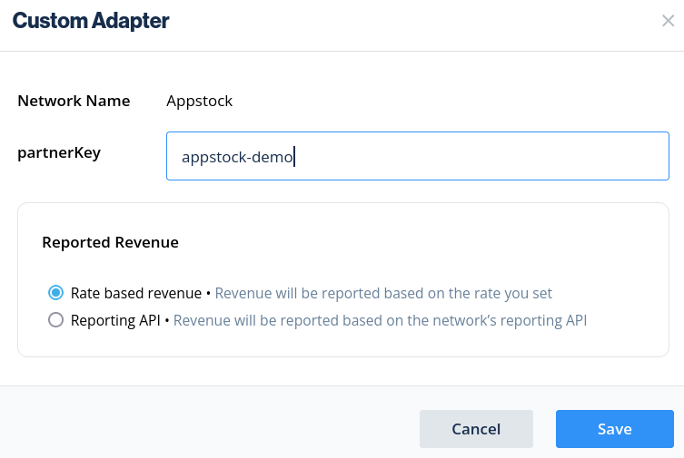
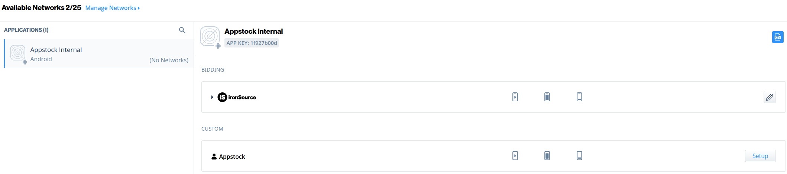
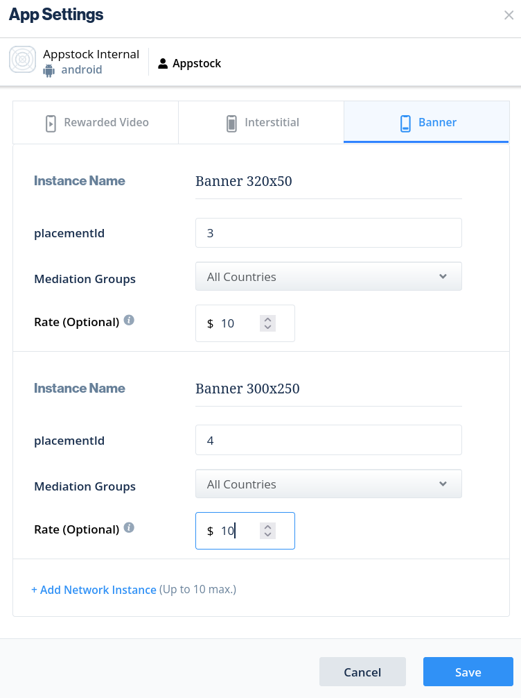

# Android Mediation - IronSource

To integrate the Appstock SDK into your app, you should add the following dependency into the `app/build.gradle` file
and sync Gradle:

```groovy
dependencies {
    implementation("com.appstock:appstock-sdk:1.1.0")
    implementation("com.appstock:appstock-sdk-ironsource-adapters:1.1.0")
}
```

Add this custom maven repository URL into the `project/settings.gradle` file:

```groovy
dependencyResolutionManagement {
    repositories {
        maven {
            setUrl("https://public-sdk.al-ad.com/android/")
        }
    }
}
```

Initialize Appstock SDK in the  `.onCreate()` method by calling `Appstock.initializeSdk()`.

Kotlin:

```kotlin
class DemoApplication : Application() {
    override fun onCreate() {
        super.onCreate()

        // Initialize Appstock SDK
        Appstock.initializeSdk(this, PARTNER_KEY)
    }
}
```

Java:

```java
public class DemoApplication extends Application {
    @Override
    public void onCreate() {
        super.onCreate();

        // Initialize Appstock SDK
        Appstock.initializeSdk(this, PARTNER_KEY);
    }
}
```

In order to add Appstock to the waterfall, you need to create a custom SDK network in your IronSource account and then
add this ad source to the desired ad units.

To create the Appstock SDK network, follow the instructions:

1. Sign in to your [IronSource account](https://platform.ironsrc.com).
2. Click **SDK networks** in the sidebar (**LevelPlay** -> **Setup**). 
3. Click **Manage networks** and **Custom Adapter**.



4. Write network key `15c03f8f1` and click **Save**.



5. Fill your **partnerKey** for the Appstock platform and click **Save**.



6. Click **Setup** in the available networks list.



7. Create network instances for all placements you have in the Appstock platform. Fill **placementId**, **Mediation Groups** and **Rate** for desired type of the ad.



8. Click **Save**. 

After setting up the SDK network it the Appstock adapters will be automatically applied in the application using reflection. 