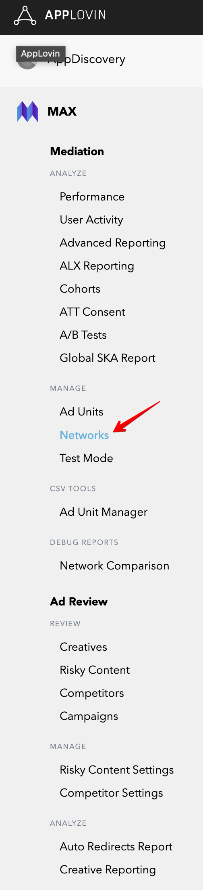
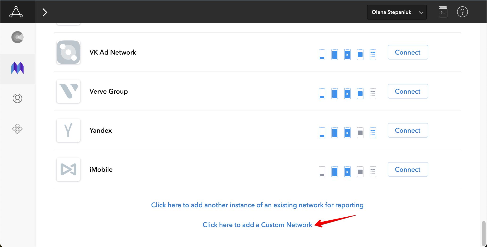
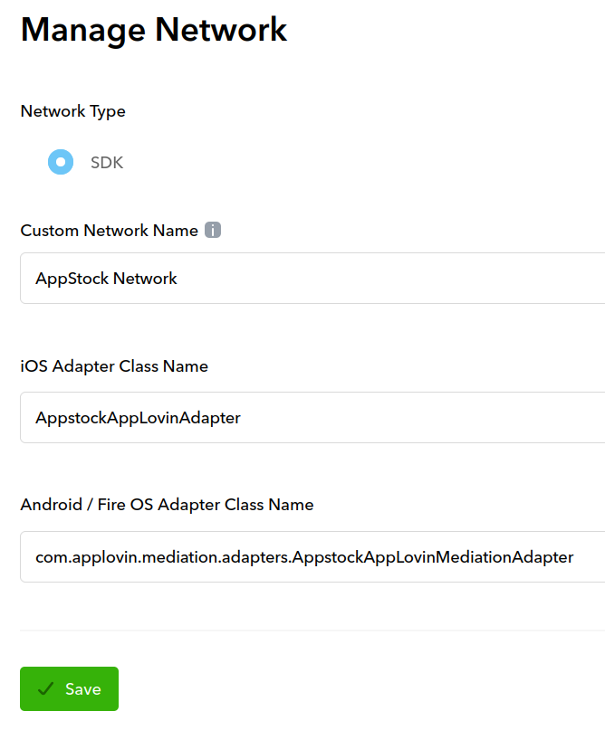
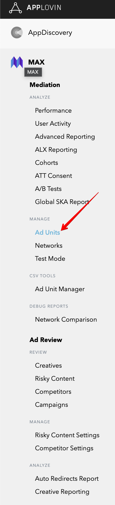
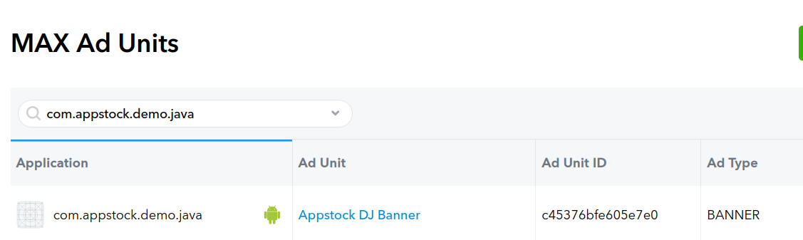
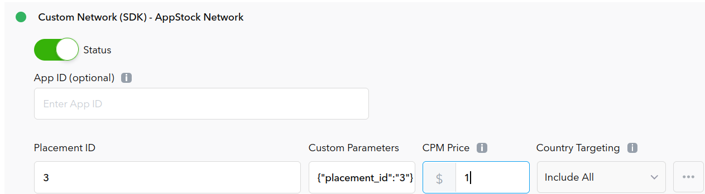

# Android Mediation - AppLovin

To integrate the Appstock SDK into your app, you should add the following dependency into the `app/build.gradle` file
and sync Gradle:

```groovy
dependencies {
    implementation("com.appstock:appstock-sdk:1.1.0")
    implementation("com.appstock:appstock-sdk-applovin-adapters:1.1.0")
}
```

Add this custom maven repository URL into the `project/settings.gradle` file:

```groovy
dependencyResolutionManagement {
    repositories {
        maven {
            setUrl("https://public-sdk.al-ad.com/android/")
        }
    }
}
```

Initialize Appstock SDK in the  `.onCreate()` method by calling `Appstock.initializeSdk()`.

Kotlin:
```kotlin
class DemoApplication : Application() {
    override fun onCreate() {
        super.onCreate()

        // Initialize Appstock SDK
        Appstock.initializeSdk(this, PARTNER_KEY)
    }
}
```

Java:
```java
public class DemoApplication extends Application {
   @Override
   public void onCreate() {
      super.onCreate();

      // Initialize Appstock SDK
      Appstock.initializeSdk(this, PARTNER_KEY);
   }
}
```

To integrate the Appstock into your AppLovin monetization stack, you should enable a Appstock SDK ad network and add it
to the respective ad units.

1. In the MAX Dashboard, select [MAX > Mediation > Manage > Networks](https://dash.applovin.com/o/mediation/networks/).



2. Click **Click here to add a Custom Network** at the bottom of the page. The **Create Custom Network** page appears.



3. Add the information about your custom network:

   Network Type : **Choose SDK**.

   Name : **Appstock**.

   Android Adapter Class Name: `com.applovin.mediation.adapters.AppstockAppLovinMediationAdapter`



4. Open [MAX > Mediation > Manage > Ad Units](https://dash.applovin.com/o/mediation/ad_units/) in the MAX dashboard.



5. Select an ad unit for which you want to add the custom SDK network that you created in the previous step.



6. Select which custom network you want to enable and enter the information for each placement. Refer to the network documentation to see what values you need to set for the **App ID**, **Placement ID**, and **Custom Parameters**.



Typically, the custom parameters field should contain a JSON that contains IDs (placement ID, endpoint ID) that will be used to load ads.

Parameters:

- **placement_id** - unique identifier generated on the platform's UI. You have to set or `placement_id` or `endpoint_id`.
- **endpoint_id** - unique identifier generated on the platform's UI. You have to set or `placement_id` or `endpoint_id`.
- **sizes** (optional) - array of the ad sizes. You can specify width in `w` field and height in `h` field. Make sure you've provided both width and height values;
- **ad_formats** (optional) - array of the ad formats. You can pass `banner` or `video` ad formats. Note that the multiformat request is not supported for the banner ad, so it uses only first value.

Examples:
```json
{
  "placement_id": "4",
  "sizes": [
    {
      "w": 729,
      "h": 90
    }
  ],
  "ad_formats": ["video"]
}
```

```json
{
  "endpoint_id": "1",
  "sizes": [
    {
      "w": 320,
      "h": 50
    },
    {
      "w": 300,
      "h": 250
    }
  ],
  "ad_formats": ["banner"]
}
```