

# Android Mediation - AdMob

To integrate the Appstock SDK into your app, you should add the following dependency into the `app/build.gradle` file and sync Gradle:

groovy
dependencies {
  implementation("com.appstock:appstock-sdk:1.0.0")
  implementation("com.appstock:appstock-sdk-google-mobile-ads-adapters:1.0.0")
}

Add this custom maven repository URL into the `project/settings.gradle` file:

groovy
dependencyResolutionManagement {
    repositories {
        maven {
            setUrl("https://public-sdk.al-ad.com/android/")
        }
    }
}

Initialize Appstock SDK in the  `.onCreate()` method by calling `Appstock.initializeSdk()`.

Kotlin:
kotlin
class DemoApplication : Application() {
    override fun onCreate() {
        super.onCreate()

        // Initialize Appstock SDK
        Appstock.initializeSdk(this, PARTNER_KEY)
    }
}

Java:
java
public class DemoApplication extends Application {
    @Override
    public void onCreate() {
        super.onCreate();

        // Initialize Appstock SDK
        Appstock.initializeSdk(this, PARTNER_KEY);
    }
}

In order to add Appstock to the waterfall, you need to create a custom event in your AdMob account and then add this event to the respective mediation groups.

To create a Appstock custom event, follow the instructions:

1. Sign in to your [AdMob account](https://apps.admob.com).
2. Click **Mediation** in the sidebar.

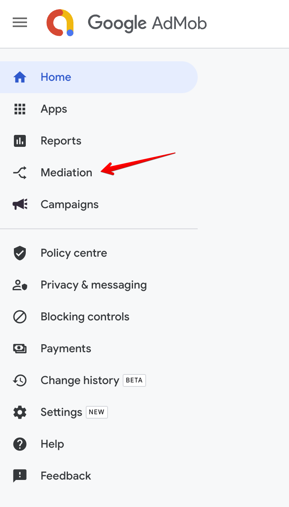

3. Click the **Waterfall sources** tab.

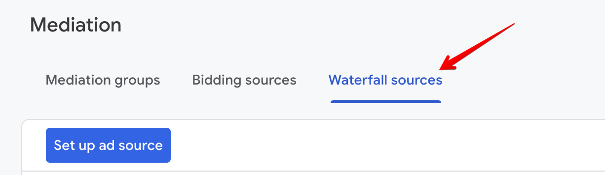

4. Click **Custom Event**.

5. Find your app in the list and сlick **Manage mappings**.

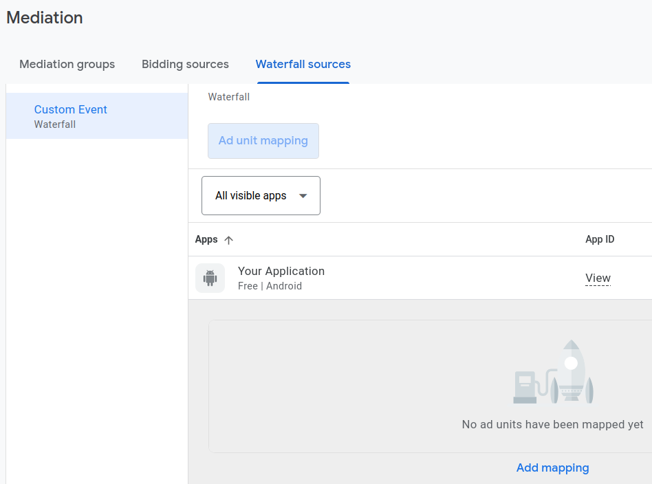

6. Click **Add mapping**. To include multiple custom events, you’ll need to set up [additional mappings](https://support.google.com/admob/answer/13395411#manage).

7. Add the mapping details, including a mapping name. Enter a class name (required) and a parameter (optional) for each ad unit. Typically, the optional parameter contains a JSON that contains IDs (placement ID, endpoint ID) that will be used by the custom event to load ads.

Parameters:

- **placement_id** - unique identifier generated on the platform's UI.
- **endpoint_id** - unique identifier generated on the platform's UI.

Example:
json
{
  "placement_id": "5"
}

Class Name: **com.appstock.sdk.admob.AppstockGadMediationAdapter**

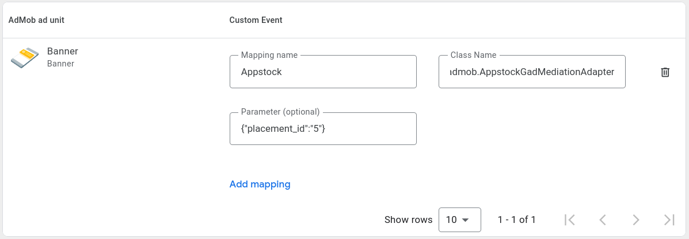

8. Click **Save**.

After you’ve finished setting up your custom event, you’re ready to add it to a mediation group. To add your ad source to an existing mediation group:

1. Sign in to your [AdMob account](https://apps.admob.com).
2. Click **Mediation** in the sidebar.

3. In the **Mediation group** tab, click the name of the mediation group to which you're adding the ad source.

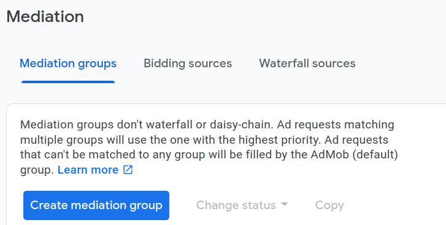

4. In the Waterfall ad sources table, click **Add custom event**.

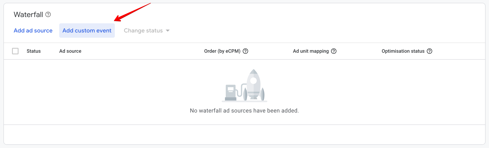

5. Enter a descriptive label for the event. Enter a manual eCPM to use for this custom event. The eCPM will be used to dynamically position the event in the mediation waterfall where it will compete with other ad sources to fill ad requests.

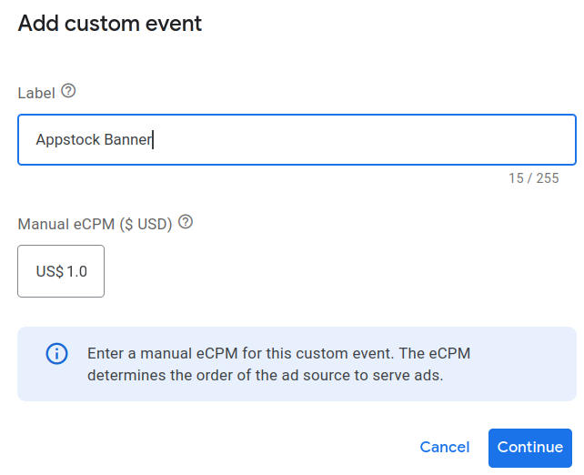

6. Click **Continue**.

7. Select an existing mapping to use for this custom event or click **Add mapping** to set up a new mapping. To use multiple custom events, you’ll have to create an additional mapping for each custom event.

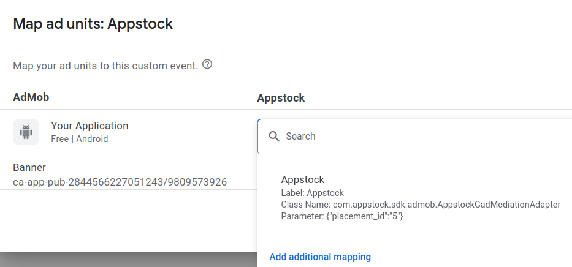

8. Click **Done**.

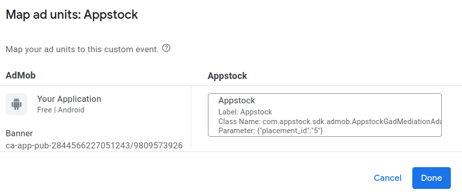

9. Click **Save**. The mediation group will be saved.

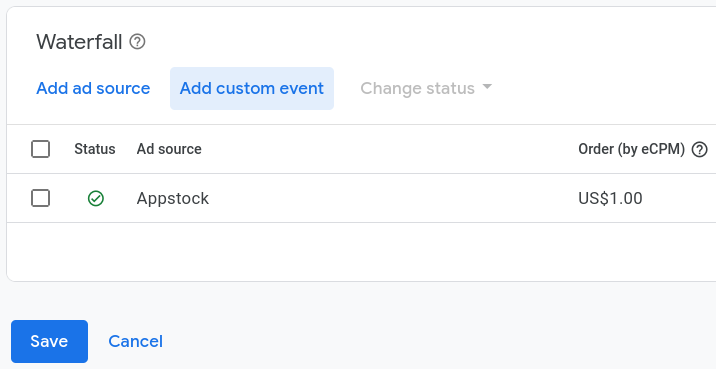

# Android Mediation - AppLovin

To integrate the Appstock SDK into your app, you should add the following dependency into the `app/build.gradle` file
and sync Gradle:

groovy
dependencies {
    implementation("com.appstock:appstock-sdk:1.0.0")
    implementation("com.appstock:appstock-sdk-applovin-adapters:1.0.0")
}

Add this custom maven repository URL into the `project/settings.gradle` file:

groovy
dependencyResolutionManagement {
    repositories {
        maven {
            setUrl("https://public-sdk.al-ad.com/android/")
        }
    }
}

Initialize Appstock SDK in the  `.onCreate()` method by calling `Appstock.initializeSdk()`.

Kotlin:
kotlin
class DemoApplication : Application() {
    override fun onCreate() {
        super.onCreate()

        // Initialize Appstock SDK
        Appstock.initializeSdk(this, PARTNER_KEY)
    }
}

Java:
java
public class DemoApplication extends Application {
   @Override
   public void onCreate() {
      super.onCreate();

      // Initialize Appstock SDK
      Appstock.initializeSdk(this, PARTNER_KEY);
   }
}

To integrate the Appstock into your AppLovin monetization stack, you should enable a Appstock SDK ad network and add it
to the respective ad units.

1. In the MAX Dashboard, select [MAX > Mediation > Manage > Networks](https://dash.applovin.com/o/mediation/networks/).

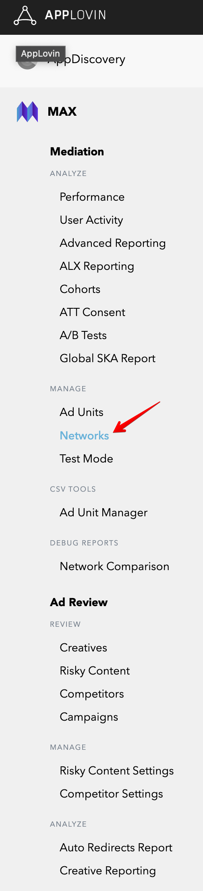

2. Click **Click here to add a Custom Network** at the bottom of the page. The **Create Custom Network** page appears.

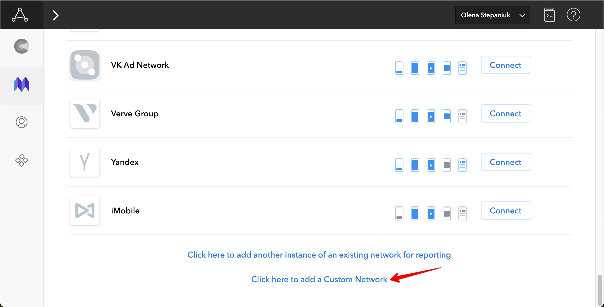

3. Add the information about your custom network:

   Network Type : **Choose SDK**.

   Name : **Appstock**.

   Android Adapter Class Name: `com.applovin.mediation.adapters.AppstockAppLovinMediationAdapter`

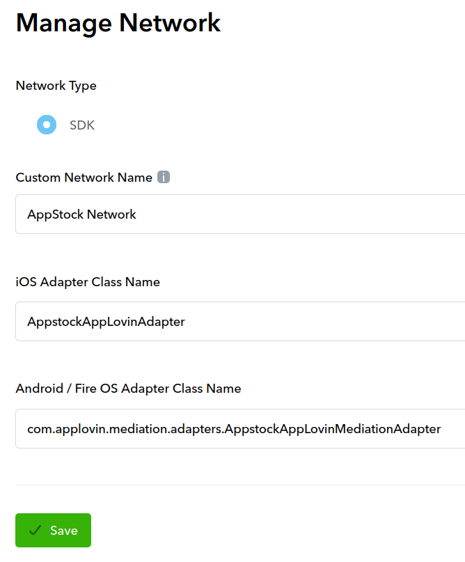

4. Open [MAX > Mediation > Manage > Ad Units](https://dash.applovin.com/o/mediation/ad_units/) in the MAX dashboard.

5. Select an ad unit for which you want to add the custom SDK network that you created in the previous step.

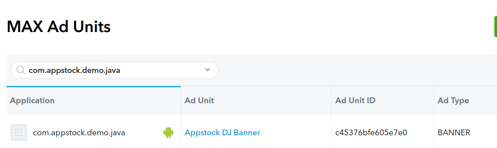

6. Select which custom network you want to enable and enter the information for each placement. Refer to the network documentation to see what values you need to set for the **App ID**, **Placement ID**, and **Custom Parameters**.

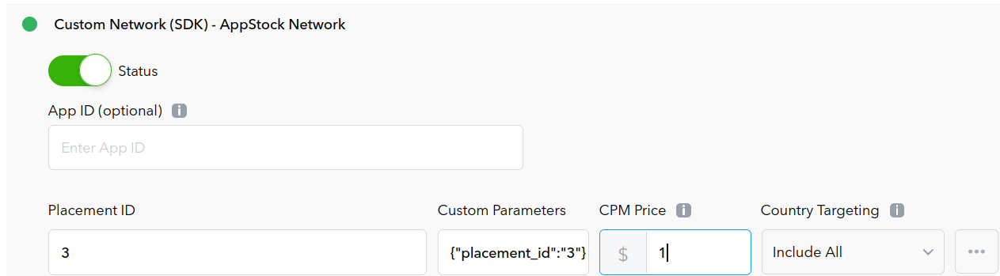

Typically, the custom parameters field should contain a JSON that contains IDs (placement ID, endpoint ID) that will be used to load ads.

Parameters:

- placement_id - unique identifier generated on the platform's UI.

- endpoint_id - unique identifier generated on the platform's UI.

Example: 

json
{
   "placement_id": "5"
}

# Android Mediation - TopOn

To integrate the Appstock SDK into your app, you should add the following dependency into the `app/build.gradle` file
and sync Gradle:

groovy
dependencies {
    implementation("com.appstock:appstock-sdk:1.0.1")
    implementation("com.appstock:appstock-sdk-topon-adapters:1.0.1")
}

Add this custom maven repository URL into the `project/settings.gradle` file:

groovy
dependencyResolutionManagement {
    repositories {
        maven {
            setUrl("https://public-sdk.al-ad.com/android/")
        }
    }
}

Initialize Appstock SDK in the  `.onCreate()` method by calling `Appstock.initializeSdk()`.

Kotlin:

kotlin
class DemoApplication : Application() {
    override fun onCreate() {
        super.onCreate()

        // Initialize Appstock SDK
        Appstock.initializeSdk(this, PARTNER_KEY)
    }
}

Java:

java
public class DemoApplication extends Application {
    @Override
    public void onCreate() {
        super.onCreate();

        // Initialize Appstock SDK
        Appstock.initializeSdk(this, PARTNER_KEY);
    }
}

In order to add Appstock to the waterfall, you need to create a custom mediation network in your TopOn account and then
add this ad source to the desired placement.

To create the Appstock ad source, follow the instructions:

1. Sign in to your [TopOn account](https://www.toponad.com/en).
2. Click **Network** in the sidebar and click **Add custom network firm**.
3. Fill the required fields. For **Adapter class name** use these values:

- Banner - **com.appstock.sdk.topon.AppstockBannerAdapter**
- Interstitial - **com.appstock.sdk.topon.AppstockInterstitialAdapter**
- Native - **com.appstock.sdk.topon.AppstockNativeAdapter**

4. Click **Confirm**.
5. Go to **Mediation** page in the sidebar.
6. Select your app and placement id and click **Add ad source**.
7. Fill the required fields. It's important to set **Price** and **Other Parameters** (placement or endpoint id).

Fields for **Other Parameters**:

- **placement_id** - unique identifier generated on the platform's UI.
- **endpoint_id** - unique identifier generated on the platform's UI.

Example:

json
{
  "placement_id": "5"
}

8. Click **Confirm**. 

### Banner ad type

For the banner ad type it's important to set the size of TopOn banner based on screen size and the standardized ad size for Appstock banner (f.e. 320x50, 300x250, 728x90).

kotlin
    val width = 320
    val height = 50
    val adView = ATBannerView(this)

    val localExtras = HashMap<String, Any>()
    localExtras[ATAdConst.KEY.AD_WIDTH] = resources.displayMetrics.widthPixels
    localExtras[ATAdConst.KEY.AD_HEIGHT] = height * resources.displayMetrics.density
    localExtras[AppstockBannerAdapter.KEY_WIDTH] = width
    localExtras[AppstockBannerAdapter.KEY_HEIGHT] = height
    adView.setLocalExtra(localExtras)

java
    int width = 320;
    int height = 50;
    ATBannerView adView = new ATBannerView(this);

    HashMap<String, Object> localExtras = new HashMap<>();
    localExtras.put(ATAdConst.KEY.AD_WIDTH, getResources().getDisplayMetrics().widthPixels);
    localExtras.put(ATAdConst.KEY.AD_HEIGHT, height * getResources().getDisplayMetrics().density);
    localExtras.put(AppstockBannerAdapter.KEY_WIDTH, width);
    localExtras.put(AppstockBannerAdapter.KEY_HEIGHT, height);
    adView.setLocalExtra(localExtras);

### Interstitial ad type

The interstitial ad type doesn't require any additional setup in code. You just have to add the Appstock mediation for the interstitial ad unit in the TopOn server.   

### Native ad type

For the native ad unit it's important to add native assets.

kotlin
    private fun createAd() {
        // 1. Create ad unit
        val adUnit = ATNative(this, AD_UNIT_ID, createListener()).also { adUnit = it }

        // 2. Configure ad unit with native config
        val localExtras = HashMap<String, Any>()
        localExtras[AppstockNativeAdConfig.KEY_EXTRAS] = createNativeConfig()
        adUnit.setLocalExtra(localExtras)

        // 3. Load ad
        adUnit.makeAdRequest()
    }

    private fun createNativeConfig(): AppstockNativeAdConfig {
        val eventTrackingMethods = ArrayList(
            Arrays.asList(
                NativeEventTracker.EventTrackingMethod.IMAGE,
                NativeEventTracker.EventTrackingMethod.JS
            )
        )
        val eventTracker = NativeEventTracker(
            NativeEventTracker.EventType.IMPRESSION,
            eventTrackingMethods
        )

        val title = NativeTitleAsset()
        title.setLength(90)
        title.isRequired = true

        val icon = NativeImageAsset(20, 20, 20, 20)
        icon.imageType = NativeImageAsset.ImageType.ICON
        icon.isRequired = true

        val mainImage = NativeImageAsset(200, 200, 200, 200)
        mainImage.imageType = NativeImageAsset.ImageType.MAIN
        mainImage.isRequired = true

        val sponsored = NativeDataAsset()
        sponsored.len = 90
        sponsored.dataType = NativeDataAsset.DataType.SPONSORED
        sponsored.isRequired = true

        val description = NativeDataAsset()
        description.dataType = NativeDataAsset.DataType.DESC
        description.isRequired = true

        val ctaText = NativeDataAsset()
        ctaText.dataType = NativeDataAsset.DataType.CTATEXT
        ctaText.isRequired = true

        val assets = Arrays.asList(
            title,
            icon,
            mainImage,
            sponsored,
            description,
            ctaText
        )

        return AppstockNativeAdConfig.Builder()
            .setContextType(NativeContextType.SOCIAL_CENTRIC)
            .setPlacementType(NativePlacementType.CONTENT_FEED)
            .setContextSubType(NativeContextSubtype.GENERAL_SOCIAL)
            .setNativeEventTrackers(listOf(eventTracker))
            .setNativeAssets(assets)
            .build()
    }

java
    private void createAd() {
        // 1. Create ad unit
        adUnit = new ATNative(this, AD_UNIT_ID, createListener());

        // 2. Configure ad unit with native config
        HashMap<String, Object> localExtras = new HashMap<>();
        localExtras.put(AppstockNativeAdConfig.KEY_EXTRAS, createNativeConfig());
        adUnit.setLocalExtra(localExtras);

        // 3. Load ad
        adUnit.makeAdRequest();
    }

    private AppstockNativeAdConfig createNativeConfig() {
        ArrayList<NativeEventTracker.EventTrackingMethod> eventTrackingMethods = new ArrayList<>(
                Arrays.asList(
                        NativeEventTracker.EventTrackingMethod.IMAGE,
                        NativeEventTracker.EventTrackingMethod.JS
                )
        );
        NativeEventTracker eventTracker = new NativeEventTracker(
                NativeEventTracker.EventType.IMPRESSION,
                eventTrackingMethods
        );

        NativeTitleAsset title = new NativeTitleAsset();
        title.setLength(90);
        title.setRequired(true);

        NativeImageAsset icon = new NativeImageAsset(20, 20, 20, 20);
        icon.setImageType(NativeImageAsset.ImageType.ICON);
        icon.setRequired(true);

        NativeImageAsset mainImage = new NativeImageAsset(200, 200, 200, 200);
        mainImage.setImageType(NativeImageAsset.ImageType.MAIN);
        mainImage.setRequired(true);

        NativeDataAsset sponsored = new NativeDataAsset();
        sponsored.setLen(90);
        sponsored.setDataType(NativeDataAsset.DataType.SPONSORED);
        sponsored.setRequired(true);

        NativeDataAsset description = new NativeDataAsset();
        description.setDataType(NativeDataAsset.DataType.DESC);
        description.setRequired(true);

        NativeDataAsset ctaText = new NativeDataAsset();
        ctaText.setDataType(NativeDataAsset.DataType.CTATEXT);
        ctaText.setRequired(true);

        List<NativeAsset> assets = Arrays.asList(
                title,
                icon,
                mainImage,
                sponsored,
                description,
                ctaText
        );

        return new AppstockNativeAdConfig.Builder()
                .setContextType(NativeContextType.SOCIAL_CENTRIC)
                .setPlacementType(NativePlacementType.CONTENT_FEED)
                .setContextSubType(NativeContextSubtype.GENERAL_SOCIAL)
                .setNativeEventTrackers(Collections.singletonList(eventTracker))
                .setNativeAssets(assets)
                .build();
    }

