# Appstock Android SDK - Overview

## Overview

Appstock SDK is a native library that monetizes Android applications.

The latest SDK version is **1.0.0**.

The minimum supported Android version: **Android 5.0** (API level **21**)

[Demo applications (Kotlin, JAVA)](https://public-sdk.al-ad.com/android/appstock-demo/demo-app-1.0.0/).

## Integration and configuration

Follow the [integration instructions](sdk-android-integration.md) to add the SDK to your app. Once the SDK is
integrated, you can provide [configuration options](6-sdk-android-parametrisation) that will help increase your
revenue. Keep in mind that the SDK supports basic [consent providers](7-sdk-android-consents) according to industry
standards.

Appstock SDK supports the following ad formats:

- [Banner](sdk-android-banner.md) (HTML + Video)
- [Interstitial](sdk-android-interstitial.md) (HTML + Video)
- [Native](sdk-android-native.md)

The SDK can be integrated directly into your app or via supported Mediation Adapters:

- [AppLovin MAX](9-sdk-android-applovin)
- [GMA SDK](8-sdk-android-admob) (AdMob, GAM)

# Appstock Android SDK - Integration

## Integration using dependency

In order to integrate Appstock SDK into your application, you should add the following dependency to
the `app/build.gradle` file and sync Gradle:

```groovy
dependencies {
    implementation("com.appstock:appstock-sdk:1.0.0")
}
```

Add this custom maven repository URL into the `project/settings.gradle` file:

```groovy
dependencyResolutionManagement {
    repositories {
        maven {
            setUrl("https://public-sdk.al-ad.com/android/")
        }
    }
}
```

Manual integration using AAR files

Copy AAR files to your Android module libs folder (f.e. app/libs/).

- [Core SDK](https://public-sdk.al-ad.com/android/com/appstock/appstock-sdk/1.0.0/appstock-sdk-1.0.0.aar)
- [Open Measurement SDK](https://public-sdk.al-ad.com/android/com/appstock/omsdk/1.5.0/omsdk-1.5.0.aar)
- [AdMob adapters](https://public-sdk.al-ad.com/android/com/appstock/appstock-sdk-google-mobile-ads-adapters/1.0.0/appstock-sdk-google-mobile-ads-adapters-1.0.0.aar)
- [AppLovin adapters](https://public-sdk.al-ad.com/android/com/appstock/appstock-sdk-applovin-adapters/1.0.0/appstock-sdk-applovin-adapters-1.0.0.aar)

Add dependencies to build.gradle file.
```groovy
implementation(files("libs/core-release.aar"))
implementation(files("libs/omsdk.aar"))

// Only for AdMob integration
implementation(files("libs/admob-adapters-release.aar"))

// Only for AppLovin integration
implementation(files("libs/applovin-adapters-release.aar"))
```

Integration using ARR files requires additional dependencies.  You should add ExoPlayer dependency for video ads and Google ads identifier dependency for better targeting.
```groovy

implementation 'com.google.android.exoplayer:exoplayer-core:2.15.1'
implementation 'com.google.android.exoplayer:exoplayer-ui:2.15.1'

implementation 'com.google.android.gms:play-services-base:18.1.0'
implementation 'com.google.android.gms:play-services-ads-identifier:18.0.1'

implementation "androidx.localbroadcastmanager:localbroadcastmanager:1.0.0"
```


## Initialization

Import the Appstock SDK core class in the main application class:

Kotlin:
```kotlin
import com.appstock.sdk.api.Appstock
```

Java:
```java
import com.appstock.sdk.api.Appstock;
```

Initialize Appstock SDK in the  `.onCreate()` method by calling `Appstock.initializeSdk()`.

Kotlin: 
```kotlin
class DemoApplication : Application() {
    override fun onCreate() {
        super.onCreate()

        // Initialize Appstock SDK
        Appstock.initializeSdk(this, PARTNER_KEY)
    }
}
```

Java: 
```java
public class DemoApplication extends Application {
    @Override
    public void onCreate() {
        super.onCreate();

        // Initialize Appstock SDK
        Appstock.initializeSdk(this, PARTNER_KEY);
    }
}
```

The `Appstock.initializeSdk()` method has two parameters:

- **context** - the reference to the Application subclass instance

- **partnerKey** - determine the Appstock server URL. The Appstock account manager should provide you with this key.

It is recommended that contextual information be provided after initialization to enrich the ad requests. For this
purpose, use [SDK parametrization properties](6-sdk-android-parametrisation).

Once SDK is initialized and all needed parameters are provided, it is ready to request the ads.

If you want to see all requests made by the SDK and verbose logs, you should enable debug mode before the initialization. 

Kotlin:
```kotlin
Appstock.setDebugRequests(true)
Appstock.setLogLevel(Appstock.LogLevel.DEBUG)
Appstock.initializeSdk(this, PARTNER_KEY)
```

Java:
```java
Appstock.setDebugRequests(true);
Appstock.setLogLevel(Appstock.LogLevel.DEBUG);
Appstock.initializeSdk(this, PARTNER_KEY);
```

# Appstock Android SDK - Banner

To load and show banner ads, you should initialize, configure, and add the `AppstockAdView` object to the app's layout and call the `loadAd()` method.

Kotlin:

```kotlin
private var adView: AppstockAdView? = null

private fun createAd() {
    // 1. Create AppstockAdView
    val adView = AppstockAdView(this).also { this.adView = it }

    // 2. Configure ad unit
    adView.setPlacementId(PLACEMENT_ID)
    adView.setAdSizes(AppstockAdSize(WIDTH, HEIGHT))
    adView.setAdViewListener(createListener())
    adView.autoRefreshDelay = 30

    // 3. Load ad
    adView.loadAd()

    // 4. Add AppstockAdView to the app UI
    containerForAd.addView(adView)
}
```

Java:
```java
private AppstockAdView adView;

private void createAd() {
    // 1. Create AppstockAdView
    adView = new AppstockAdView(this);

    // 2. Configure ad unit
    adView.setPlacementId(PLACEMENT_ID);
    adView.setAdSizes(new AppstockAdSize(WIDTH, HEIGHT));
    adView.setAutoRefreshDelay(30);
    adView.setAdViewListener(createListener());

    // 3. Load ad
    adView.loadAd();

    // 4. Add AppstockAdView to the app UI
    getContainerForAd().addView(adView);
}
```

The `AppstockAdView` should be provided with one of the required configuration properties:

- `setPlacementId()` - Unique placement identifier generated on the Appstock platform's UI.
- `setEndpointId()` - Unique endpoint identifier generated on the Appstock platform's UI.

Which one to use depends on your type of Appstock account.

**Important note**: `setAdSizes()` should provide standard advertisement sizes, not the sizes of the screen.  

It's important to destroy ad view after leaving the screen. It cleans the resources and stops auto refresh. Or you can just stop auto refresh using `stopAutoRefresh()`.

Kotlin:
```kotlin
override fun onDestroy() {
    adView?.destroy()
}
```

Java:
```java
@Override
public void onDestroy() {
    super.onDestroy();
    if (adView != null) {
        adView.destroy();
    }
}
```

If you need to integrate video ads, you can also use the `AppstockAdView` object in the same way as for banner ads. The single required change is you should explicitly set the ad format via the respective property:

Kotlin:
```kotlin
adView.setAdUnitFormat(AppstockAdUnitFormat.VIDEO)
```

Java:
```java
adView.setAdUnitFormat(AppstockAdUnitFormat.VIDEO);
```

Once it is done, the Appstock SDK will make ad requests for video placement and render the respective creatives.

Additionally, you can set more parameters for better advertisement targeting.

Kotlin:
```kotlin
adView.setAdPosition(AppstockBannerAdPosition.HEADER)
adView.setVideoPlacementType(AppstockVideoPlacementType.IN_BANNER) // Only for video ad unit format
```

Java:
```java
adView.setAdPosition(AppstockBannerAdPosition.HEADER);
adView.setVideoPlacementType(AppstockVideoPlacementType.IN_BANNER); // Only for video ad unit format
```

You can optionally subscribe to the ad’s lifecycle events by implementing the `AppstockAdViewListener` interface:

Kotlin:
```kotlin
private fun createListener(): AppstockAdViewListener {
    return object : AppstockAdViewListener {
        override fun onAdLoaded(adView: AppstockAdView) {
            // Called when ad loaded
            Log.d(TAG, "Ad loaded successfully")
        }

        override fun onAdFailed(adView: AppstockAdView, e: AppstockAdException) {
            // Called when ad failed to load or parse
            Log.e(TAG, "Ad failed to load: " + e.message)
        }

        override fun onAdDisplayed(adView: AppstockAdView) {
            // Called when ad displayed
        }

        override fun onAdClicked(adView: AppstockAdView) {
            // Called when ad clicked
        }

        override fun onAdClosed(adView: AppstockAdView) {
            // Called when ad closed
        }
    }
}
```

Java:
```java
private static AppstockAdViewListener createListener() {
    return new AppstockAdViewListener() {
        @Override
        public void onAdLoaded(AppstockAdView AppstockAdView) {
            // Called when ad loaded
            Log.d(TAG, "Ad loaded successfully");
        }

        @Override
        public void onAdFailed(AppstockAdView AppstockAdView, AppstockAdException e) {
            // Called when ad failed to load
            Log.e(TAG, "Ad failed to load: " + e.getMessage());
        }

        @Override
        public void onAdDisplayed(AppstockAdView AppstockAdView) {
            // Called when ad displayed on screen
        }

        @Override
        public void onAdClicked(AppstockAdView AppstockAdView) {
            // Called when ad clicked
        }

        @Override
        public void onAdClosed(AppstockAdView AppstockAdView) {
            // Called when ad hidden
        }
    };
}
```

Or you can subscribe to the video ad events (only for video ad unit format).

Kotlin:
```kotlin
private fun createListener(): AppstockAdViewVideoListener {
    return object : AppstockAdViewVideoListener {
        override fun onVideoCompleted(bannerView: AppstockAdView?) {
            Log.d(TAG, "Video completed")
        }

        override fun onVideoPaused(bannerView: AppstockAdView?) {
            Log.d(TAG, "Video paused")
        }

        override fun onVideoResumed(bannerView: AppstockAdView?) {
            Log.d(TAG, "Video resumed")
        }

        override fun onVideoUnMuted(bannerView: AppstockAdView?) {
            Log.d(TAG, "Video unmuted")
        }

        override fun onVideoMuted(bannerView: AppstockAdView?) {
            Log.d(TAG, "Video muted")
        }

    }
}
```

Java:
```java
private static AppstockAdViewVideoListener createListener() {
    return new AppstockAdViewVideoListener() {

        @Override
        public void onVideoCompleted(AppstockAdView teqBlazeAdView) {
            Log.d(TAG, "Video completed");
        }

        @Override
        public void onVideoPaused(AppstockAdView teqBlazeAdView) {
            Log.d(TAG, "Video paused");
        }

        @Override
        public void onVideoResumed(AppstockAdView teqBlazeAdView) {
            Log.d(TAG, "Video resumed");
        }

        @Override
        public void onVideoUnMuted(AppstockAdView teqBlazeAdView) {
            Log.d(TAG, "Video un muted");
        }

        @Override
        public void onVideoMuted(AppstockAdView teqBlazeAdView) {
            Log.d(TAG, "Video muted");
        }
    };
}
```


# Appstock Android SDK - Interstitial

To load and show interstitial ads, you should initialize, configure, and add the `AppstockInterstitialAdUnit` object to the app's layout and call the `loadAd()` method. Once the ad is loaded, you can invoke the `show()` method at any appropriate point of the app flow to present the fullscreen ad.

Kotlin:
```kotlin
private var adUnit: AppstockInterstitialAdUnit? = null

private fun createAd() {
    // 1. Create AppstockInterstitialAdUnit
    adUnit = AppstockInterstitialAdUnit(this)

    // 2. Configure ad unit
    adUnit?.setPlacementId(PLACEMENT_ID)
    adUnit?.setInterstitialAdUnitListener(createListener())
    adUnit?.setAdSizes(AppstockAdSize(320, 480))

    // 3. Load ad
    adUnit?.loadAd()
}
```

Java:
```java
private AppstockInterstitialAdUnit adUnit;

private void createAd() {
    // 1. Create AppstockInterstitialAdUnit
    adUnit = new AppstockInterstitialAdUnit(this);

    // 2. Configure ad unit
    adUnit.setPlacementId(PLACEMENT_ID);
    adUnit.setInterstitialAdUnitListener(createListener());

    // 3. Load ad
    adUnit.loadAd();
}
```

If you need to integrate **video** ads or **multiformat** ads, you should set the `adFormats` property to the respective value:        

**Important note**: `setAdSizes()` should provide standard advertisement sizes, not the sizes of the screen.

It's important to destroy ad unit after leaving the screen. It cleans the resources and stops auto refresh.

Kotlin:
```kotlin
override fun onDestroy() {
    adUnit?.destroy()
}
```

Java:
```java
@Override
public void onDestroy() {
    super.onDestroy();
    if (adUnit != null) {
        adUnit.destroy();
    }
}
```

If you need to integrate video ads or multiformat ads, you should set the adFormats property to the respective value:

Kotlin:
```kotlin
// Make ad request for video ad
adUnit.setAdUnitFormats(EnumSet.of(AppstockAdUnitFormat.VIDEO))

// Make ad request for both video and banner ads (default behaviour)
adUnit.setAdUnitFormats(EnumSet.of(AppstockAdUnitFormat.BANNER, AppstockAdUnitFormat.VIDEO))

// Make ad request for banner ad
adUnit.setAdUnitFormats(EnumSet.of(AppstockAdUnitFormat.BANNER))
```

Java:
```java
// Make ad request for video ad
adUnit.setAdUnitFormats(EnumSet.of(AppstockAdUnitFormat.VIDEO));

// Make ad request for both video and banner ads (default behaviour)
adUnit.setAdUnitFormats(EnumSet.of(AppstockAdUnitFormat.BANNER, AppstockAdUnitFormat.VIDEO));

// Make ad request for banner ad
adUnit.setAdUnitFormats(EnumSet.of(AppstockAdUnitFormat.BANNER));
```

Once the ad is loaded, you can invoke the `show()` method at any appropriate point of the app flow to present the full-screen ad. To know when the ad is loaded, you should implement `AppstockInterstitialAdUnitListener` interface and subscribe to the ad events in its methods.

When the delegate’s method `onAdLoaded` is called, it means that the SDK has successfully loaded the ad. Starting from this point, you can call the `show()` method to display the full-screen ad.

Kotlin:
```kotlin
private fun createListener(): AppstockInterstitialAdUnitListener {
    return object : AppstockInterstitialAdUnitListener {
        override fun onAdLoaded(adUnit: AppstockInterstitialAdUnit) {
            // Called when ad loaded
            Log.d(TAG, "Ad loaded successfully")

            // 4. Show ad
            adUnit.show()
        }

        override fun onAdDisplayed(adUnit: AppstockInterstitialAdUnit) {
            // Called when ad displayed full screen
            Log.d(TAG, "Ad displayed")
        }

        override fun onAdFailed(
            adUnit: AppstockInterstitialAdUnit,
            e: AppstockAdException,
        ) {
            // Called when ad failed to load or parse
            Log.e(TAG, "Ad failed to load: " + e.message, e)
        }

        override fun onAdClicked(adUnit: AppstockInterstitialAdUnit) {
            // Called when ad clicked
        }

        override fun onAdClosed(adUnit: AppstockInterstitialAdUnit) {
            // Called when ad closed
        }
    }
}
```

Java:
```java
private static AppstockInterstitialAdUnitListener createListener() {
    return new AppstockInterstitialAdUnitListener() {
        @Override
        public void onAdLoaded(AppstockInterstitialAdUnit adUnit) {
            // Called when ad loaded
            Log.d(TAG, "Ad loaded successfully");

            // 4. Show ad
            adUnit.show();
        }

        @Override
        public void onAdDisplayed(AppstockInterstitialAdUnit adUnit) {
            // Called when ad displayed full screen
            Log.d(TAG, "Ad displayed");
        }

        @Override
        public void onAdFailed(AppstockInterstitialAdUnit adUnit, AppstockAdException e) {
            // Called when ad failed to load
            Log.e(TAG, "Ad failed to load: " + e.getMessage());
        }

        @Override
        public void onAdClicked(AppstockInterstitialAdUnit adUnit) {
            // Called when ad clicked
        }

        @Override
        public void onAdClosed(AppstockInterstitialAdUnit adUnit) {
            // Called when ad closed
        }
    };
}
```

### Rendering Controls

The following properties enable rendering customization of video interstitial ads.

| Setter                  | Description                                                                                                                                                     |
|-------------------------|-----------------------------------------------------------------------------------------------------------------------------------------------------------------|
| setIsMuted              | This option lets you switch the sound on or off during playback. Default is `false`.                                                                            |
| setCloseButtonArea      | This setting determines the percentage of the device screen that the close button should cover. Allowed range - `0...1`. Default value is `0.1`.                |
| setSkipButtonPosition   | This setting controls where the close button appears on the screen. Allowed values: `topLeft`, `topRight`. Other values will be ignored. Default is `topRight`. |
| setSkipButtonArea       | This setting determines the percentage of the device screen that the skip button should cover. Allowed range - `0...1`. Default value is `0.1`.                 |
| setSkipButtonPosition   | This control sets the position of the skip button. Allowed values: `topLeft`, `topRight`. Other values will be ignored. Default is `topLeft`.                   |
| setSkipDelay            | This setting determines the number of seconds after the start of playback before the skip or close button should appear. Default value is `10.0`.               |
| setIsSoundButtonVisible | This option switches on or off the visibility of the sound/mute button for users. Default value is `false`.                                                     |


Usage examples:

Kotlin:
```kotlin
adUnit.setSkipDelay(10)
adUnit.setSkipButtonPosition(AppstockPosition.TOP_RIGHT)
adUnit.setSkipButtonArea(0.2) 

adUnit.setCloseButtonPosition(AppstockPosition.TOP_RIGHT)
adUnit.setCloseButtonArea(0.2)

adUnit.setIsMuted(true) 
adUnit.setIsSoundButtonVisible(true)
```

Java:
```java
adUnit.setSkipDelay(10);
adUnit.setSkipButtonPosition(AppstockPosition.TOP_RIGHT);
adUnit.setSkipButtonArea(0.2);

adUnit.setCloseButtonPosition(AppstockPosition.TOP_RIGHT);
adUnit.setCloseButtonArea(0.2);

adUnit.setIsMuted(true); 
adUnit.setIsSoundButtonVisible(true);
```

# Appstock Android SDK - Native

To load a native ad, you should initialize and configure `AppstockNativeAdUnit` object and call the `loadAd()` method.

Kotlin:

```kotlin
private var adUnit: AppstockNativeAdUnit? = null

private fun createAd() {
    // 1. Create AppstockNativeAdUnit
    adUnit = AppstockNativeAdUnit()

    // 2. Configure ad unit with native config
    adUnit?.setPlacementId(PLACEMENT_ID)
    adUnit?.setNativeAdConfig(createNativeConfig())

    // 3. Load ad
    adUnit?.loadAd { result: AppstockNativeResult ->
        val nativeAd = result.nativeAd
        if (nativeAd == null) {
            Log.e("AdExample", "Native ad is null: " + result.status)
            return@loadAd
        }

        Log.d(TAG, "Native ad loaded successfully")
        // 4. Create native view
        createNativeView(nativeAd)
    }
}

private fun createNativeConfig(): AppstockNativeAdConfig {
    val eventTrackingMethods = ArrayList(
        Arrays.asList(
            NativeEventTracker.EventTrackingMethod.IMAGE,
            NativeEventTracker.EventTrackingMethod.JS
        )
    )
    val eventTracker = NativeEventTracker(
        NativeEventTracker.EventType.IMPRESSION,
        eventTrackingMethods
    )

    val title = NativeTitleAsset()
    title.setLength(90)
    title.isRequired = true

    val icon = NativeImageAsset(20, 20, 20, 20)
    icon.imageType = NativeImageAsset.ImageType.ICON
    icon.isRequired = true

    val mainImage = NativeImageAsset(200, 200, 200, 200)
    mainImage.imageType = NativeImageAsset.ImageType.MAIN
    mainImage.isRequired = true

    val sponsored = NativeDataAsset()
    sponsored.len = 90
    sponsored.dataType = NativeDataAsset.DataType.SPONSORED
    sponsored.isRequired = true


    val description = NativeDataAsset()
    description.dataType = NativeDataAsset.DataType.DESC
    description.isRequired = true

    val ctaText = NativeDataAsset()
    ctaText.dataType = NativeDataAsset.DataType.CTATEXT
    ctaText.isRequired = true

    val assets = Arrays.asList(
        title,
        icon,
        mainImage,
        sponsored,
        description,
        ctaText
    )

    return AppstockNativeAdConfig.Builder()
        .setContextType(NativeContextType.SOCIAL_CENTRIC)
        .setPlacementType(NativePlacementType.CONTENT_FEED)
        .setContextSubType(NativeContextSubtype.GENERAL_SOCIAL)
        .setNativeEventTrackers(listOf(eventTracker))
        .setNativeAssets(assets)
        .build()
}
```

Java:

```java
private AppstockNativeAdUnit adUnit;

private void createAd() {
    // 1. Create AppstockNativeAdUnit
    adUnit = new AppstockNativeAdUnit();

    // 2. Configure ad unit with native config
    adUnit.setPlacementId(PLACEMENT_ID);
    adUnit.setNativeAdConfig(createNativeConfig());

    // 3. Load ad
    adUnit.loadAd((result) -> {
        AppstockNativeAd nativeAd = result.getNativeAd();
        if (nativeAd == null) {
            Log.e("AdExample", "Native ad is null: " + result.getStatus());
            return;
        }

        Log.d(TAG, "Native ad loaded successfully");
        // 4. Create native view
        createNativeView(nativeAd);
    });
}

private AppstockNativeAdConfig createNativeConfig() {
    ArrayList<NativeEventTracker.EventTrackingMethod> eventTrackingMethods = new ArrayList<>(
            Arrays.asList(
                    NativeEventTracker.EventTrackingMethod.IMAGE,
                    NativeEventTracker.EventTrackingMethod.JS
            )
    );
    NativeEventTracker eventTracker = new NativeEventTracker(
            NativeEventTracker.EventType.IMPRESSION,
            eventTrackingMethods
    );

    NativeTitleAsset title = new NativeTitleAsset();
    title.setLength(90);
    title.setRequired(true);

    NativeImageAsset icon = new NativeImageAsset(20, 20, 20, 20);
    icon.setImageType(NativeImageAsset.ImageType.ICON);
    icon.setRequired(true);

    NativeImageAsset mainImage = new NativeImageAsset(200, 200, 200, 200);
    mainImage.setImageType(NativeImageAsset.ImageType.MAIN);
    mainImage.setRequired(true);

    NativeDataAsset sponsored = new NativeDataAsset();
    sponsored.setLen(90);
    sponsored.setDataType(NativeDataAsset.DataType.SPONSORED);
    sponsored.setRequired(true);


    NativeDataAsset description = new NativeDataAsset();
    description.setDataType(NativeDataAsset.DataType.DESC);
    description.setRequired(true);

    NativeDataAsset ctaText = new NativeDataAsset();
    ctaText.setDataType(NativeDataAsset.DataType.CTATEXT);
    ctaText.setRequired(true);

    List<NativeAsset> assets = Arrays.asList(
            title,
            icon,
            mainImage,
            sponsored,
            description,
            ctaText
    );

    return new AppstockNativeAdConfig.Builder()
            .setContextType(NativeContextType.SOCIAL_CENTRIC)
            .setPlacementType(NativePlacementType.CONTENT_FEED)
            .setContextSubType(NativeContextSubtype.GENERAL_SOCIAL)
            .setNativeEventTrackers(Collections.singletonList(eventTracker))
            .setNativeAssets(assets)
            .build();
}
```

## AppstockNativeAdConfig

The class responsible for configuration native ad parameters. Here is a brief description of parameters for the builder:

- **`setNativeAssets`** - an array of assets associated with the native ad.

- **`setNativeEventTrackers`** - an array of event trackers used for tracking native ad events.

- **`setContextType`** - the context type for the native ad (e.g., content, social).

- **`setContextSubType`** - a more detailed context in which the ad appears.

- **`setPlacementType`** - the design/format/layout of the ad unit being offered.

- **`setPlacementCount`** - the number of identical placements in this layout. Default is `1`.

- **`setSequence`** - the sequence number of the ad in a series. Default is `0`.

- **`setAUrlSupport`** - whether the supply source / impression impression supports returning an assetsurl instead of
  an asset object. Default is `0` (unsupported).

- **`setDUrlSupport`**  - whether the supply source / impression supports returning a dco url instead of an asset object.
  Default is `0` (unsupported).

- **`setPrivacy`**  - set to 1 when the native ad support buyer-specific privacy notice. Default is `0`.

- **`setExt`**  - a dictionary to hold any additional data as key-value pairs.

Once the ad is loaded, the SDK provides you with a `AppstockNativeAd` object in the callback of the `loadAd()` method.
This object contains ad assets that you should apply to the native ad layout.


## Assets configuration


### NativeTitleAsset

Request asset for the advertisement title. Parameters:

- `length` - the length of the title.
- `required` - flag whether the field is mandatory. 
- `ext` - additional json data. 

Kotlin:

```kotlin
    val title = NativeTitleAsset()
    title.setLength(90)
    title.isRequired = true
```

Java:

```java
    NativeTitleAsset title = new NativeTitleAsset();
    title.setLength(90);
    title.setRequired(true);
```


### NativeDataAsset

Request asset for any text data. Parameters:

- `length` - the length of the data.
- `type` - the type of data asset (e.g., sponsored, description).
- `required` - flag whether the field is mandatory.
- `ext` - additional json data.

Kotlin:

```kotlin
    val sponsored = NativeDataAsset()
    sponsored.len = 90
    sponsored.dataType = NativeDataAsset.DataType.SPONSORED
    sponsored.isRequired = true
```

Java:

```java
    NativeDataAsset sponsored = new NativeDataAsset();
    sponsored.setLen(90);
    sponsored.setDataType(NativeDataAsset.DataType.SPONSORED);
    sponsored.setRequired(true);
```

Available data types:

- `SPONSORED` - represents sponsored content.
- `DESC` - represents a description.
- `RATING` - represents a rating.
- `LIKES` - represents likes.
- `DOWNLOADS` - represents download count.
- `PRICE` - represents the price.
- `SALEPRICE` - represents a sale price.
- `PHONE` - represents a phone number.
- `ADDRESS` - represents an address.
- `DESC2` - represents a secondary description.
- `DESPLAYURL` - represents a display URL.
- `CTATEXT` - represents call-to-action text.
- `CUSTOM` - represents a custom data asset. You can set custom exchange id. 


### ImageDataAsset

Request asset for image. In the example below we request ad with desired size 200x200, and minimal size: 30x30. Parameters:

- `imageType` - the type of image asset (e.g., icon, main image).
- `width`, `height` - the desired size of the image.
- `minWidth`, `minHeight` - the minimum allowed size of the image. 
- `mimes` - an array of supported MIME types for the image.
- `required` - flag whether the field is mandatory.
- `ext` - additional json data.

Kotlin:

```kotlin
    val mainImage = NativeImageAsset(200, 200, 30, 30)
    mainImage.imageType = NativeImageAsset.ImageType.MAIN
    mainImage.isRequired = true
    mainImage.addMime("image/jpeg")
```

Java:

```java
    NativeImageAsset mainImage = new NativeImageAsset(200, 200, 200, 200);
    mainImage.setImageType(NativeImageAsset.ImageType.MAIN);
    mainImage.setRequired(true);
    mainImage.addMime("image/jpeg")
```

Available data types:

- `ICON` - represents an icon image asset.
- `MAIN` - represents a main image asset.
- `CUSTOM` - represents a custom image asset.


## Native event tracking

You can also specify what type of event tracking is supported. For that you need to set `setEventTrackers` setter.

Kotlin:
```kotlin
    val eventTrackingMethods = ArrayList(
        Arrays.asList(
            NativeEventTracker.EventTrackingMethod.IMAGE,
            NativeEventTracker.EventTrackingMethod.JS
        )
    )
    val eventTracker = NativeEventTracker(
        NativeEventTracker.EventType.IMPRESSION,
        eventTrackingMethods
    )
```

Java:
```java
    ArrayList<NativeEventTracker.EventTrackingMethod> eventTrackingMethods = new ArrayList<>(
            Arrays.asList(
                    NativeEventTracker.EventTrackingMethod.IMAGE,
                    NativeEventTracker.EventTrackingMethod.JS
            )
    );
    NativeEventTracker eventTracker = new NativeEventTracker(
            NativeEventTracker.EventType.IMPRESSION,
            eventTrackingMethods
    );
```

The event method configures desired tracking method:
- `Impression` - represents an impression event.                                                                   
- `ViewableImpression50` - represents a 50% viewable impression event.                                                    
- `ViewableImpression100` - represents a 100% viewable impression event.                                                 
- `ViewableVideoImpression50` - represents a 50% viewable video impression event.                                         
- `Custom` - represents a custom event type.         

The event type configures desired tracking type:
- `Image` - represents image-based event tracking.                                                            
- `JS` - represents JavaScript-based event tracking.                                                       
- `Custom` - represents a custom tracking method.


## Native view for the ad

Once the ad is loaded, the SDK provides you with a `AppstockNativeAd` object in the callback of the `loadAd()` method. This object contains ad assets that you should apply to the native ad layout.

Kotlin:

```kotlin
private fun createNativeView(ad: AppstockNativeAd) {
    val nativeContainer = View.inflate(this, R.layout.layout_native, null)

    val icon = nativeContainer.findViewById<ImageView>(R.id.imgIcon)
    ImageUtils.download(ad.iconUrl, icon)

    val title = nativeContainer.findViewById<TextView>(R.id.tvTitle)
    title.text = ad.title

    val image = nativeContainer.findViewById<ImageView>(R.id.imgImage)
    ImageUtils.download(ad.imageUrl, image)

    val description = nativeContainer.findViewById<TextView>(R.id.tvDesc)
    description.text = ad.description

    val cta = nativeContainer.findViewById<Button>(R.id.btnCta)
    cta.text = ad.callToAction

    containerForAd.addView(nativeContainer)

    ad.registerView(nativeContainer, Lists.newArrayList(icon, title, image, description, cta), createListener())
}
```

Java:

```java
private void createNativeView(AppstockNativeAd ad) {
    View nativeContainer = View.inflate(this, R.layout.layout_native, null);

    ImageView icon = nativeContainer.findViewById(R.id.imgIcon);
    ImageUtils.download(ad.getIconUrl(), icon);

    TextView title = nativeContainer.findViewById(R.id.tvTitle);
    title.setText(ad.getTitle());

    ImageView image = nativeContainer.findViewById(R.id.imgImage);
    ImageUtils.download(ad.getImageUrl(), image);

    TextView description = nativeContainer.findViewById(R.id.tvDesc);
    description.setText(ad.getDescription());

    Button cta = nativeContainer.findViewById(R.id.btnCta);
    cta.setText(ad.getCallToAction());
    getContainerForAd().addView(nativeContainer);

    ad.registerView(nativeContainer, Arrays.asList(icon, title, image, description, cta), createListener());
}
```

If you need to manage stages of the ad lifecycle you should implement the `AppstockNativeAdUnitEventListener` interface.

Kotlin:

```kotlin
private fun createListener(): AppstockNativeAdUnitEventListener {
    return object : AppstockNativeAdUnitEventListener {
        override fun onAdImpression() {
            // Called when ad displayed
            Log.d(TAG, "Ad displayed on the screen")
        }

        override fun onAdClicked() {
            // Called when ad clicked
            Log.d(TAG, "Ad clicked")
        }

        override fun onAdExpired() {
            // Called when ad expired
            Log.d(TAG, "Ad expired")
        }
    }
}
```

Java:

```java
private static AppstockNativeAdUnitEventListener createListener() {
    return new AppstockNativeAdUnitEventListener() {
        @Override
        public void onAdImpression() {
            // Called when ad displayed
            Log.d(TAG, "Ad displayed on the screen");
        }

        @Override
        public void onAdClicked() {
            // Called when ad clicked
            Log.d(TAG, "Ad clicked");
        }

        @Override
        public void onAdExpired() {
            // Called when ad expired
            Log.d(TAG, "Ad expired");
        }
    };
}
```


# Appstock Android SDK - Parametrisation

## Configuration via `AppstockTargeting` class

The `AppstockTargeting` class provided a set of properties that allow to enrich the ad request.

| Method                                  | Description                                                                                                                                                                                                                   | OpenRTB Field        |
|-----------------------------------------|-------------------------------------------------------------------------------------------------------------------------------------------------------------------------------------------------------------------------------|----------------------|
| `AppstockTargeting.setPublisherName()`  | App's publisher name                                                                                                                                                                                                          | `app.publisher.name` |
| `AppstockTargeting.setDomain()`         | Domain of the app (e.g., `mygame.foo.com`).                                                                                                                                                                                   | `app.domain`         |
| `AppstockTargeting.setStoreUrl()`       | App store URL for an installed app.                                                                                                                                                                                           | `app.storeurl`       |
| `AppstockTargeting.setSubjectToCOPPA()` | Integer flag indicating if this request is subject to the COPPA regulations established by the USA FTC, where 0 = no, 1 = yes                                                                                                 | `regs.coppa`         |
| `AppstockTargeting.setExternalUserId()` | App store URL for an installed app.                                                                                                                                                                                           | `user.ext.eids[]`    |
| `AppstockTargeting.setUserLatLong()`    | Location of the user’s home base defined by a Geo object This is not necessarily their current location.                                                                                                                      | `user.geo.lat/lon`   |
| `AppstockTargeting.setUserKeywords()`   | Comma separated list of keywords, interests, or intent.                                                                                                                                                                       | `user.keywords`      |
| `AppstockTargeting.setUserCustomData()` | Optional feature to pass bidder data that was set in the exchange’s cookie. The string must be in base85 cookie safe characters and be in any format. Proper JSON encoding must be used to include “escaped” quotation marks. | `user.customdata`    |

Usage examples:

Kotlin:
```kotlin
    AppstockTargeting.setPublisherName("appstock")
    AppstockTargeting.setDomain("appstock.com")
    AppstockTargeting.setStoreUrl("https://google.play.url")
    AppstockTargeting.setSubjectToCOPPA(true)
    AppstockTargeting.setExternalUserId(ExternalUserId("adserver.org", "111111111111", null, mapOf("rtiPartner" to "TDID")))
    AppstockTargeting.setUserLatLong(35.82348f, 23.8243823f)
    AppstockTargeting.setUserKeywords(setOf("cats", "hobby", "sport"))
    AppstockTargeting.setUserCustomData("custom")
    Appstock.initializeSdk(context, PARTNER_KEY)
```

Java:
```java
    AppstockTargeting.setPublisherName("appstock");
    AppstockTargeting.setDomain("appstock.com");
    AppstockTargeting.setStoreUrl("https://google.play.url");
    AppstockTargeting.setSubjectToCOPPA(true);
    AppstockTargeting.setUserLatLong(35.82348f, 23.8243823f);
    AppstockTargeting.setUserCustomData("custom");

    HashMap<String, Object> externalUserIdExt = new HashMap<>();
    externalUserIdExt.put("rtiPartner", "TDID");
    AppstockTargeting.setExternalUserId(new ExternalUserId("adserver.org", "111111111111", null, externalUserIdExt));
    
    HashSet<String> keywords = new HashSet<>();
    keywords.add("cats");
    keywords.add("sport");
    AppstockTargeting.setUserKeywords(keywords);
    
    Appstock.initializeSdk(context, PARTNER_KEY);
```

## Configuration via `Appstock` class

Public methods:

- `initializeSdk`  - initializes the SDK.
- `setEndpointId` - a unique identifier generated on the platform's UI.
- `setExternalUserIds` - an array containing objects that hold external user ID parameters.
- `setAssignNativeAssetId` - determines whether the asset ID for native ads should be manually assigned.
- `setDebugRequests` - sets debug mode for verbose logging of requests and responses bodies (use with `setLogLevel(LogLevel.DEBUG)`)
- `setLogLevel` - sets the desired verbosity level for the SDK's logs.
- `setTimeoutMillis` - set network HTTP timeout for all requests. 
- `setCreativeFactoryTimeout` - timeout for parsing and render banner ads content (default: 6000).
- `setCreativeFactoryTimeoutPreRenderContent` - timeout for parsing and render video ads content (default: 30000).

Kotlin:
```kotlin
    Appstock.setEndpointId("endpoint_id")
    Appstock.getAssignNativeAssetId(true)
    Appstock.setDebugRequests(true)
    Appstock.setLogLevel(Appstock.LogLevel.DEBUG)
    
    Appstock.setTimeoutMillis(3000)
    Appstock.setCreativeFactoryTimeout(10000)
    Appstock.setCreativeFactoryTimeoutPreRenderContent(40000)
    
    val externalUserIdExt = HashMap<String, Any>()
    externalUserIdExt["rtiPartner"] = "TDID"
    val externalUserId = ExternalUserId("adserver.org", "111111111111", null, externalUserIdExt)
    Appstock.setExternalUserIds(List.of(externalUserId))
    
    Appstock.initializeSdk(this, PARTNER_KEY)
```

Java:
```java
    Appstock.setEndpointId(ENDPOINT_ID);
    Appstock.getAssignNativeAssetId(true);
    Appstock.setDebugRequests(true);
    Appstock.setLogLevel(Appstock.LogLevel.DEBUG);
    
    Appstock.setTimeoutMillis(3000);
    Appstock.setCreativeFactoryTimeout(10_000);
    Appstock.setCreativeFactoryTimeoutPreRenderContent(40_000);
    
    HashMap<String, Object> externalUserIdExt = new HashMap<>();
    externalUserIdExt.put("rtiPartner", "TDID");
    ExternalUserId externalUserId = new ExternalUserId("adserver.org", "111111111111", null, externalUserIdExt);
    Appstock.setExternalUserIds(List.of(externalUserId));
    
    Appstock.initializeSdk(this, PARTNER_KEY);
```
# Appstock Android SDK - Consent Management

Appstock SDK reads consent data provided by CMPs from User Settings and sends it in the ad request. You shouldn’t do
anything except to be sure that the CMP SDKs write data into particular place in the user storage defined by the IAB
standards.

The following table describes which data is used by SDK and how exactly:

| Storage Key                                                                                                                                                  | Description                                                                                                                                                                                                      |                                                    |
|--------------------------------------------------------------------------------------------------------------------------------------------------------------|------------------------------------------------------------------------------------------------------------------------------------------------------------------------------------------------------------------|----------------------------------------------------|
| [TCF v2](https://github.com/InteractiveAdvertisingBureau/GDPR-Transparency-and-Consent-Framework/blob/master/TCFv2/IAB%20Tech%20Lab%20-%20CMP%20API%20v2.md) |                                                                                                                                                                                                                  |                                                    |
| `IABTCF_gdprApplies`                                                                                                                                         | Number: <br> 1 GDPR applies in current context <br> 0 - GDPR does not apply in current context <br> Unset - undetermined (default before initialization)                                                         | `regs.ext.gdpr`                                    |
| `IABTCF_TCString`                                                                                                                                            | String: Full encoded TC string                                                                                                                                                                                   | `user.ext.consent`                                 |
| `IABTCF_PurposeConsents`                                                                                                                                     | Binary String: The '0' or '1' at position n – where n's indexing begins at 0 – indicates the consent status for purpose ID n+1; false and true respectively. eg. '1' at index 0 is consent true for purpose ID 1 | Defines the ability of SDK to collect device info. |
| [CCPA](https://github.com/InteractiveAdvertisingBureau/USPrivacy/blob/master/CCPA/USP%20API.md)                                                              |                                                                                                                                                                                                                  |                                                    |
| `IABUSPrivacy_String`                                                                                                                                        | String: Aligns with IAB OpenRTB CCPA Advisory. <br> The String encodes all choices and information.                                                                                                              | `regs.ext.us_privacy`                              |
| [GPP](https://github.com/InteractiveAdvertisingBureau/Global-Privacy-Platform/blob/main/Core/CMP%20API%20Specification.md)                                   |                                                                                                                                                                                                                  |                                                    |
| `IABGPP_HDR_GppString`                                                                                                                                       | Full consent string in its encoded form                                                                                                                                                                          | `regs.gpp`                                         |
| `IABGPP_GppSID`                                                                                                                                              | Section ID(s) considered to be in force. Multiple IDs are separated by underscore, e.g. “2_3”                                                                                                                    | `regs.gpp_sid`                                     |

# Android Mediation - AdMob

To integrate the Appstock SDK into your app, you should add the following dependency into the `app/build.gradle` file and sync Gradle:

```groovy
dependencies {
  implementation("com.appstock:appstock-sdk:1.0.0")
  implementation("com.appstock:appstock-sdk-google-mobile-ads-adapters:1.0.0")
}
```

Add this custom maven repository URL into the `project/settings.gradle` file:

```groovy
dependencyResolutionManagement {
    repositories {
        maven {
            setUrl("https://public-sdk.al-ad.com/android/")
        }
    }
}
```

Initialize Appstock SDK in the  `.onCreate()` method by calling `Appstock.initializeSdk()`.

Kotlin:
```kotlin
class DemoApplication : Application() {
    override fun onCreate() {
        super.onCreate()

        // Initialize Appstock SDK
        Appstock.initializeSdk(this, PARTNER_KEY)
    }
}
```

Java:
```java
public class DemoApplication extends Application {
    @Override
    public void onCreate() {
        super.onCreate();

        // Initialize Appstock SDK
        Appstock.initializeSdk(this, PARTNER_KEY);
    }
}
```

In order to add Appstock to the waterfall, you need to create a custom event in your AdMob account and then add this event to the respective mediation groups.

To create a Appstock custom event, follow the instructions:

1. Sign in to your [AdMob account](https://apps.admob.com).
2. Click **Mediation** in the sidebar.

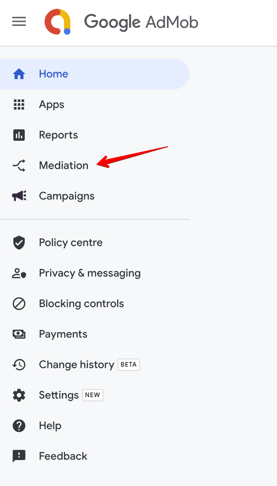

3. Click the **Waterfall sources** tab.

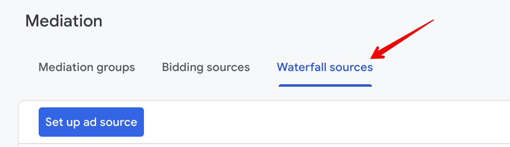

4. Click **Custom Event**.

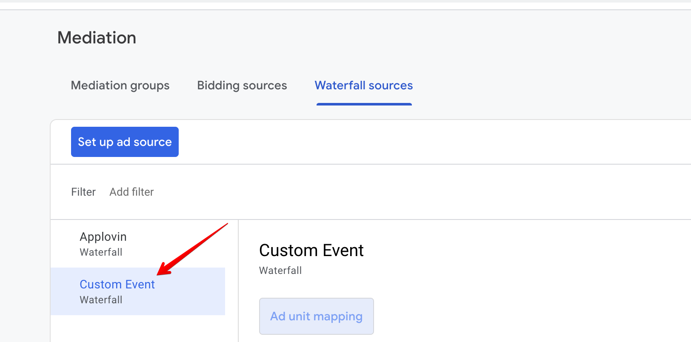

5. Find your app in the list and сlick **Manage mappings**.

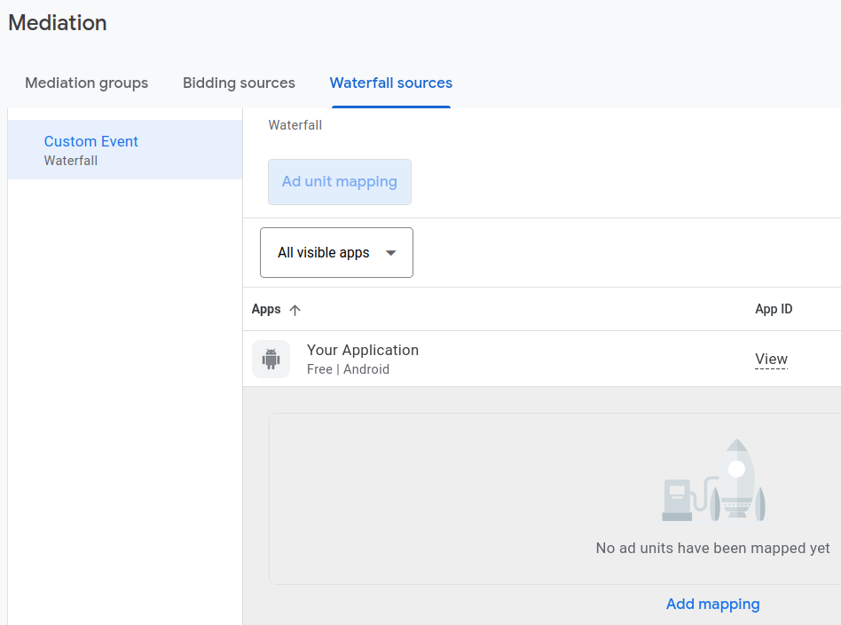

6. Click **Add mapping**. To include multiple custom events, you’ll need to set up [additional mappings](https://support.google.com/admob/answer/13395411#manage).

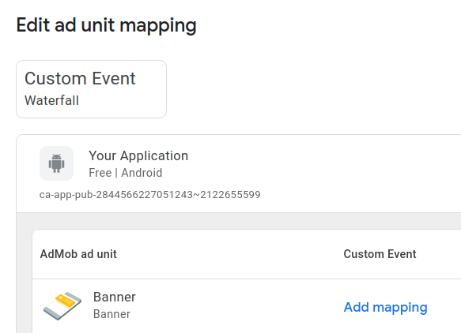

7. Add the mapping details, including a mapping name. Enter a class name (required) and a parameter (optional) for each ad unit. Typically, the optional parameter contains a JSON that contains IDs (placement ID, endpoint ID) that will be used by the custom event to load ads.

Parameters:

- **placement_id** - unique identifier generated on the platform's UI.
- **endpoint_id** - unique identifier generated on the platform's UI.

Example:
```json
{
  "placement_id": "5"
}
```

Class Name: **com.appstock.sdk.admob.AppstockGadMediationAdapter**

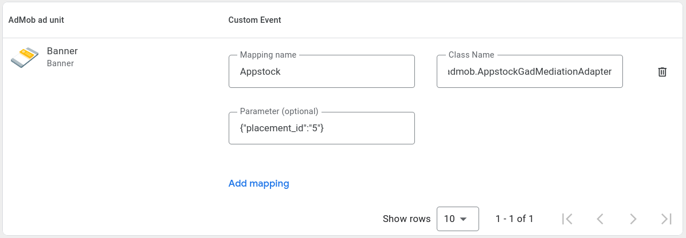

8. Click **Save**.

After you’ve finished setting up your custom event, you’re ready to add it to a mediation group. To add your ad source to an existing mediation group:

1. Sign in to your [AdMob account](https://apps.admob.com).
2. Click **Mediation** in the sidebar.


3. In the **Mediation group** tab, click the name of the mediation group to which you're adding the ad source.

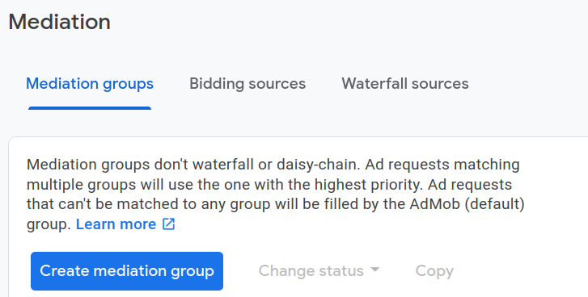

4. In the Waterfall ad sources table, click **Add custom event**.

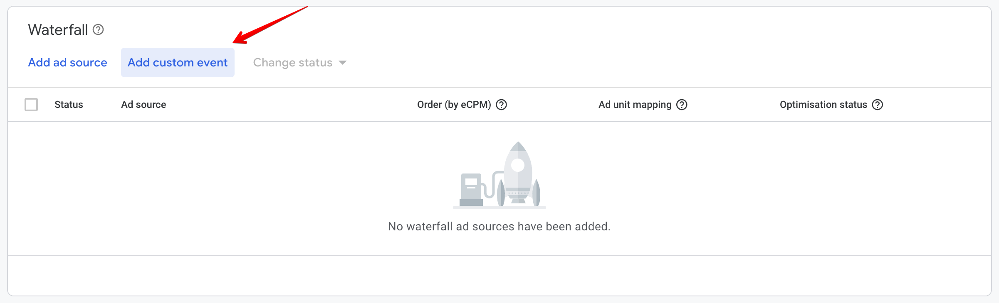

5. Enter a descriptive label for the event. Enter a manual eCPM to use for this custom event. The eCPM will be used to dynamically position the event in the mediation waterfall where it will compete with other ad sources to fill ad requests.

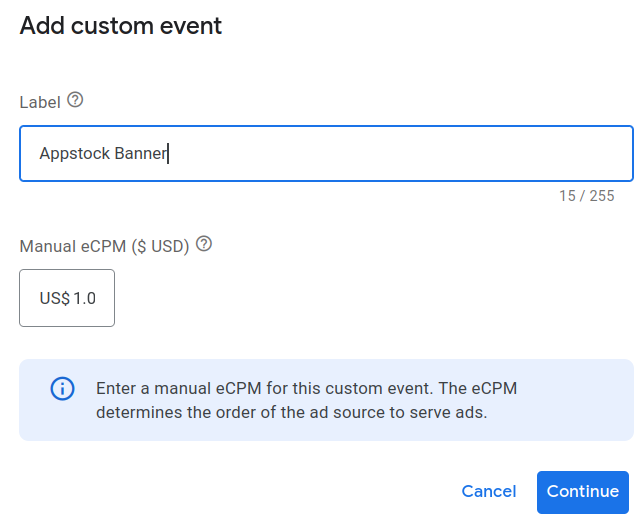

6. Click **Continue**.

7. Select an existing mapping to use for this custom event or click **Add mapping** to set up a new mapping. To use multiple custom events, you’ll have to create an additional mapping for each custom event.

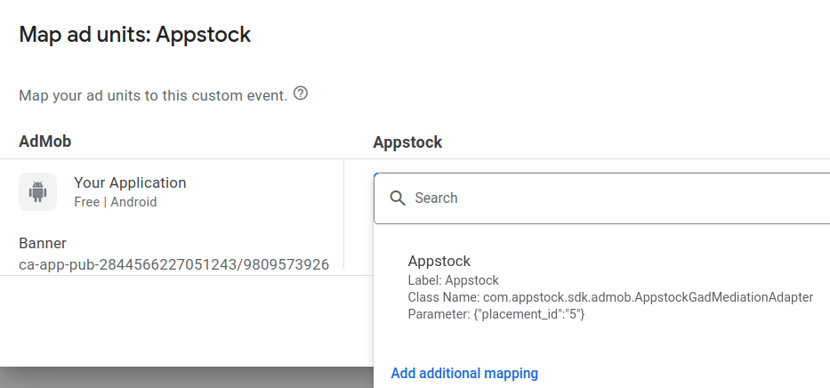

8. Click **Done**.

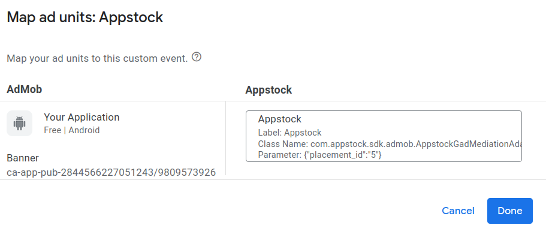

9. Click **Save**. The mediation group will be saved.

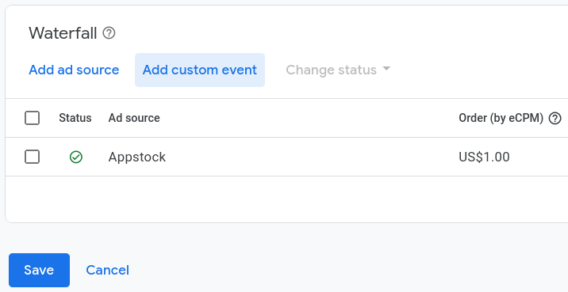


# Android Mediation - AppLovin

To integrate the Appstock SDK into your app, you should add the following dependency into the `app/build.gradle` file
and sync Gradle:

```groovy
dependencies {
    implementation("com.appstock:appstock-sdk:1.0.0")
    implementation("com.appstock:appstock-sdk-applovin-adapters:1.0.0")
}
```

Add this custom maven repository URL into the `project/settings.gradle` file:

```groovy
dependencyResolutionManagement {
    repositories {
        maven {
            setUrl("https://public-sdk.al-ad.com/android/")
        }
    }
}
```

Initialize Appstock SDK in the  `.onCreate()` method by calling `Appstock.initializeSdk()`.

Kotlin:
```kotlin
class DemoApplication : Application() {
    override fun onCreate() {
        super.onCreate()

        // Initialize Appstock SDK
        Appstock.initializeSdk(this, PARTNER_KEY)
    }
}
```

Java:
```java
public class DemoApplication extends Application {
   @Override
   public void onCreate() {
      super.onCreate();

      // Initialize Appstock SDK
      Appstock.initializeSdk(this, PARTNER_KEY);
   }
}
```

To integrate the Appstock into your AppLovin monetization stack, you should enable a Appstock SDK ad network and add it
to the respective ad units.

1. In the MAX Dashboard, select [MAX > Mediation > Manage > Networks](https://dash.applovin.com/o/mediation/networks/).

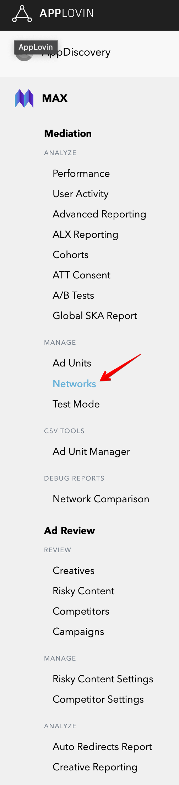

2. Click **Click here to add a Custom Network** at the bottom of the page. The **Create Custom Network** page appears.

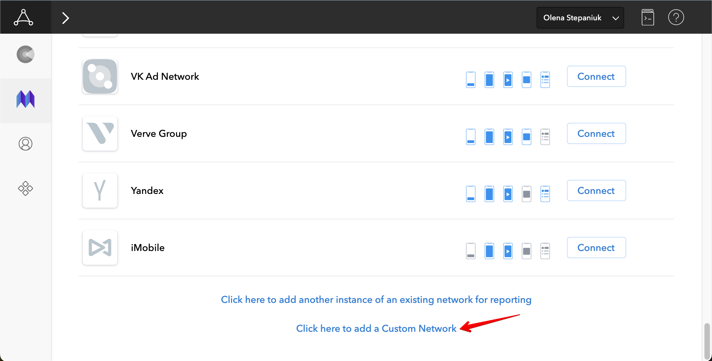

3. Add the information about your custom network:

   Network Type : **Choose SDK**.

   Name : **Appstock**.

   Android Adapter Class Name: `com.applovin.mediation.adapters.AppstockAppLovinMediationAdapter`

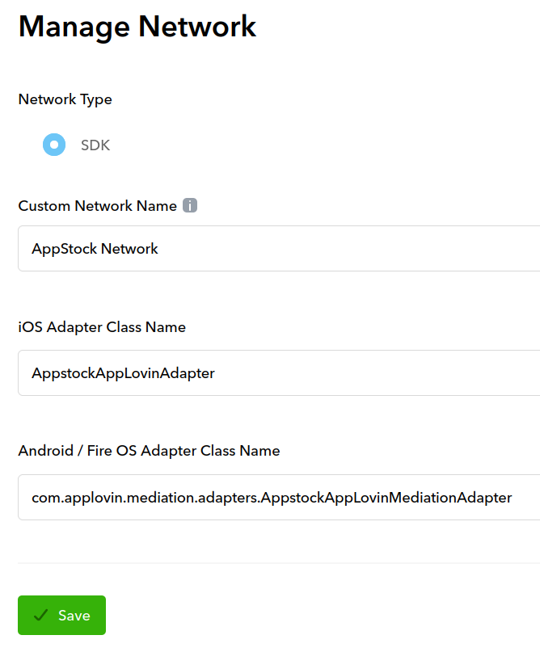

4. Open [MAX > Mediation > Manage > Ad Units](https://dash.applovin.com/o/mediation/ad_units/) in the MAX dashboard.

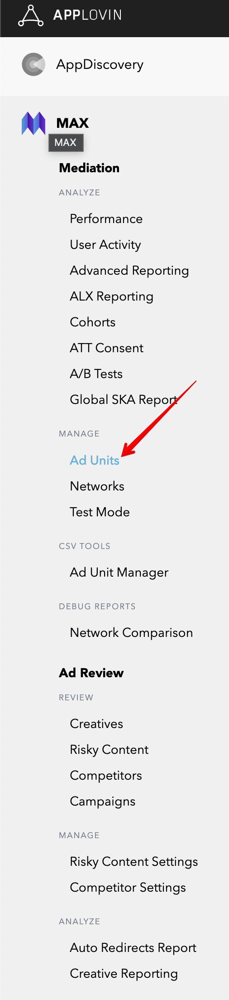

5. Select an ad unit for which you want to add the custom SDK network that you created in the previous step.

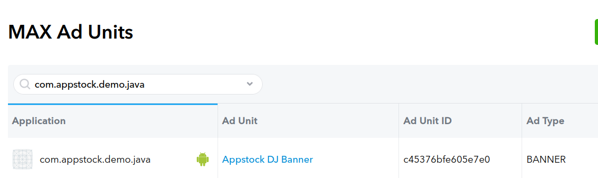

6. Select which custom network you want to enable and enter the information for each placement. Refer to the network documentation to see what values you need to set for the **App ID**, **Placement ID**, and **Custom Parameters**.

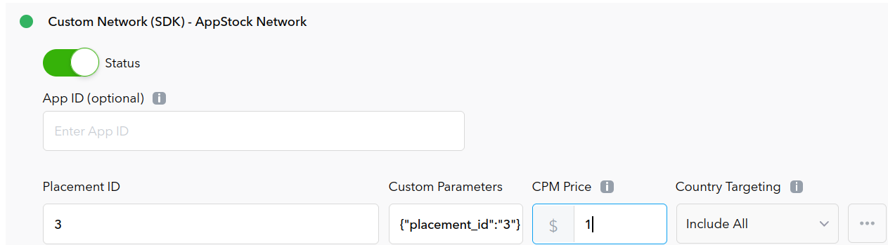

Typically, the custom parameters field should contain a JSON that contains IDs (placement ID, endpoint ID) that will be used to load ads.

Parameters:

- placement_id - unique identifier generated on the platform's UI.

- endpoint_id - unique identifier generated on the platform's UI.

Example: 

```json
{
   "placement_id": "5"
}
```
